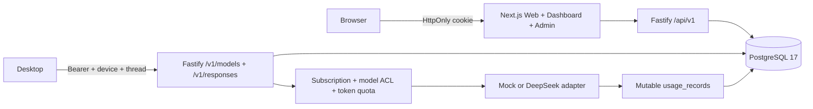

# Copilot Bridge Server V2 — Current Architecture and Gap Analysis

Baseline: deployed Server source commit `534cb791f2dc412722b1b14bc719d3e615a160eb`. Gateway API V1 contract `1.0.0` is frozen at tag `gateway-api-v1.0.0`; the current production integration manifest is [PRODUCTION_INTEGRATION_MANIFEST.md](protocol/PRODUCTION_INTEGRATION_MANIFEST.md). This analysis precedes V2 schema or API changes.

## Current architecture

The server is a pnpm modular monolith: Fastify API, Next.js Web, Drizzle/PostgreSQL, Zod/OpenAPI contract, and Docker Compose behind Caddy and the host's existing Nginx. V1 Desktop Mock and production test-only Mock integration pass; the commercial release gate remains open.

| Area | Current implementation | V2 gap |
| --- | --- | --- |
| Authentication | Argon2id passwords, bearer JWT, hashed rotating refresh tokens, browser cookie sessions, rate limits, Admin RBAC. | No dedicated device-session domain or per-request trace across billing; V2 error shape must be additive. |
| User | `users` with role/status/email; account and admin list/detail. | No wallet, referral identity, BYOS connections, account-level billing policy or financial summary. |
| Subscription | Standard/Pro plans, dated subscriptions, manual grant, cancellation, upgrade/downgrade fields, disabled plans until configured. | Plans express token/credit caps rather than monthly points and rollover policy; no idempotent period grant to a wallet. |
| Copilot Account | Copilot provider seeded disabled. | No reviewed Copilot adapter, OAuth/credential lifecycle or managed-vs-BYOS account model. Needs user authorization and legal review. |
| Provider | Adapter interface; test Mock and DeepSeek chat-completion adapter; AES-256-GCM managed credential storage. | No provider account ownership, credential validation, native streaming, normalized multimodal usage, Qwen/OpenAI-compatible/local adapters. |
| Model | Catalog, plan ACL, user override, capability flags and usage weight. | No versioned rate-card association, provider billing policy, user-owned model visibility or point pricing. |
| Proxy / Responses API | Auth/device/subscription/model checks, JSON and SSE framing, tool continuation, session scope, timeout. | SSE emitted after provider completion; disconnect can zero a charged request; no durable AI request lifecycle, request-id billing lookup, or wallet debit. |
| Usage | Mutable `usage_records` tracks status, tokens, weighted credit, approximate provider cost. | No immutable raw usage event, cached/reasoning/image/tool dimensions, provider report snapshot, rate-card version or separation of usage and charge. |
| Admin | Users, devices, plans, subscriptions, usage, orders, providers, models, releases and audit routes/UI. | No wallets, adjustments, rate-card version publishing, referral risk/rewards or margin analytics. |
| Database | One generated migration; normalized account/device/subscription/model/order/audit tables; persistent production volume. | No wallets/ledger, rate cards, immutable metering, referrals, provider ownership, AI-request lifecycle. Existing `usage_records` must be preserved as legacy. |
| API | Frozen V1 Desktop Zod/OpenAPI, `/api/v1/*` product routes, `/v1/*` Gateway. | Add V2 domain endpoints without changing V1 wire fields or status semantics silently; publish `docs/api-v2.md`. |
| Device | User-owned devices, stable random UUID, active/revoked states, plan capacity, revocation and last seen. | No blocked state, explicit installation ID, first/updated timestamps, request counts or risk metadata. MAC is not used. |
| Billing | Manual order and admin mark-paid subscription transaction; QR/payment event placeholders. | No point wallet/immutable ledger, rating engine, versioned rates, idempotent credit/debit, refund path, provider cost and gross-margin report. |

## Compatibility and migration constraints

1. Keep the existing `/v1/models`, `/v1/responses`, login, device, account, subscription, usage and release responses usable throughout migration. The V1 OpenAPI hash remains pinned. New fields or endpoints require an explicit version review; do not reinterpret `usageCredit` as points.
2. Add V2 tables and nullable links in forward-only migrations. Preserve every `usage_records` row as **legacy usage**. Do not create fictional historical wallet debits or rate-card versions from V1 token counts.
3. Keep the production test-only Mock gate and exact-account restriction. V2 wallet checks must not accidentally expose the Mock model to other users or block the existing integration account before a deliberate cutover.
4. Separate immutable provider-reported usage from the commercial charge. A rating result references an immutable rate-card version; a wallet transaction references the AI request and is unique for that charge.
5. Use PostgreSQL row locks and unique idempotency keys for grants, usage debits, refunds and referral rewards. A cached wallet balance is never the sole source of truth.
6. Record a request lifecycle before invoking a provider. On disconnect or provider error, retain any actual usage received and settle once. Never silently turn observed usage into zero.
7. Keep V2 managed, BYOS and local billing policies separate. No provider credentials or raw prompts/tool output are stored in usage or audit logs.

## Delivery sequence

1. Publish V2 architecture, ER model, API and migration design.
2. Add schema/migration plus wallet, ledger, rating and immutable usage services with concurrency and idempotency tests.
3. Add device metadata, referral qualification/reward, provider ownership and admin/API surfaces.
4. Bridge the existing Gateway to the new request lifecycle behind an explicit rollout flag; verify the V1 integration path before and after.
5. Stage the forward migration, run compatibility and failure tests, then deploy with a database backup and a documented rollback decision.
