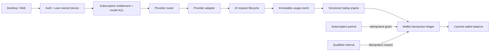
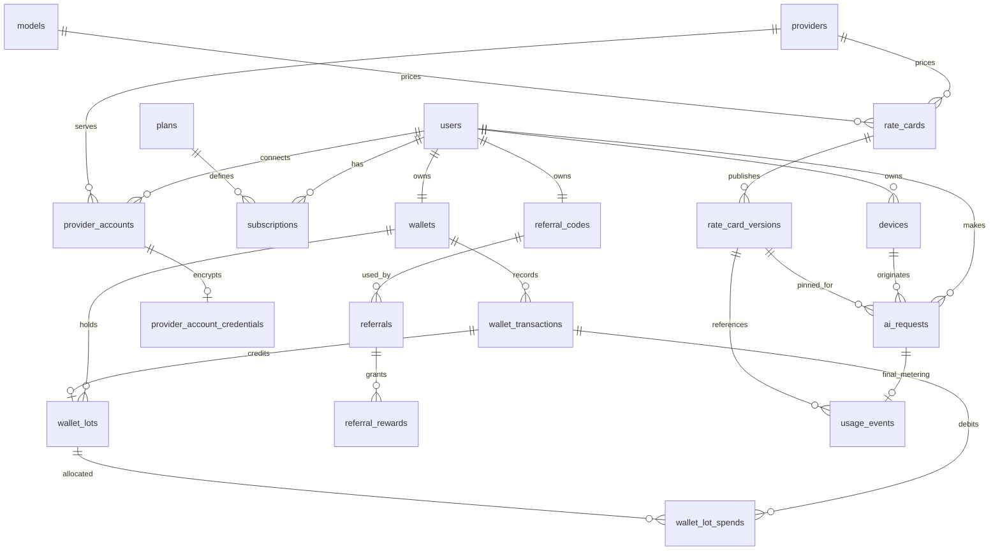

# Copilot Bridge Server V2 architecture

Contract version `2.0.0`; implementation and production rollout remain staged. [api-v2.md](api-v2.md) is the sole V2 App/Server wire contract. V1 Gateway contract `1.0.0` and its production integration manifest remain authoritative for Desktop V1 integration. V2 billing is disabled unless `V2_BILLING_ENABLED=true`; the production Mock path is excluded even when enabled.

## Domain boundaries

The legacy `usage_records` table continues to enforce the frozen V1 token and credit quota. It is neither renamed nor backfilled into financial history. V2 requests link to a legacy record for transition, while `usage_events` stores immutable provider observations. The `rate_card_version_id` is selected before provider invocation and copied to the final event. It never changes when an Admin publishes a new price.

## Entity relationships

`devices.device_id` is an installation UUID generated by the App, scoped to a user. It is never a MAC address. A user's current plan sets `max_devices`; registration serializes on the user row, so simultaneous logins cannot exceed capacity. `device_sessions` stores derived activity, hashed IP and request count; the existing device row remains the auth source. `BLOCKED` and `REVOKED` both fail bearer checks.

## Metering and rating

`usage_events` holds input/output/cached/reasoning tokens, image counts, tool calls, the provider's usage-only object, provider cost and currency when actually known, billable policy, the pinned rate version, rated points and charged points. Prompts, tool arguments and credential values are excluded. A database trigger rejects updates and deletes. Missing provider cost remains `null` and is never treated as zero cost.

Rates are decimal AI points per 1,000 tokens or per image/tool item. Cached input and reasoning output are subsets of the respective totals; the rating engine subtracts the subset before applying its dedicated rate. It uses fixed-point integer arithmetic and rounds **once** upward to a whole point. `1 point` is a commercial unit and never claims to equal one token. `MANAGED_USAGE` and `BYOS_USAGE` require an active rate card; `LOCAL_USAGE` is zero points and does not use a cloud token rate. A BYOS service charge can be represented by the BYOS card's rates or minimum charge. The policy must be selected by a trusted router; clients cannot choose it.

Before a V2 managed request, the API checks an active version, current wallet balance and no outstanding `UNPAID`, `METERING_ERROR` or `UNRATED` event. It still enforces V1 entitlement and quota during transition. Every started V2 request is settled once under a PostgreSQL row lock. If actual usage exceeds the remaining balance, the immutable event records `points_rated`, `points_charged=0`, `billing_status=UNPAID`; further V2 requests are denied. This is a recorded receivable, **not** a silent negative wallet. Invalid provider counters produce `METERING_ERROR`, rating failure `UNRATED`; both require review. A future collection/refund flow must reference the event in a new ledger entry rather than mutate it. Provider failure with no observed usage creates `NO_USAGE`; a disconnect after provider usage is observed is charged. If an upstream abort prevents the adapter from reporting usage, the event truthfully records no observed counters and the case needs reconciliation.

Wallet changes lock the user wallet row, inspect a globally unique idempotency key, check the nonnegative balance, update its cache and append a ledger row in one transaction. The immutable ledger is the accounting evidence. Admin adjustments require a reason, idempotency key and audit row in the same transaction. Subscription grants are unique per subscription period. Plan `monthly_points` defaults to zero for migrated V1 plans; no historical points are fabricated. Wallet lots and immutable allocations implement earliest-expiry-first spending. `rollover_policy=NONE` expires unspent grant points at period end; `UNLIMITED` retains them. Migration `0003` and the expiration job must be deployed before using this code in production. Public point billing is still disabled.

## Request lifecycle and provider ownership

`CREATED → STARTED → COMPLETED | CLIENT_DISCONNECTED | PROVIDER_ERROR` is persisted in `ai_requests`; the final event is unique per request. The existing DeepSeek adapter uses its Chat Completions API and normalizes the returned counters. The adapter contract isolates model-specific I/O. Native progressive streaming, Copilot OAuth, Qwen, custom OpenAI-compatible servers and local execution remain separate adapter work. Server-managed keys use the existing AES-256-GCM master key from the environment. A user can connect a DeepSeek BYOS key after server-side validation; its encrypted credential is tied to a user-owned account, and an explicit connection header selects BYOS routing/rating. No public endpoint accepts an arbitrary user URL, avoiding that SSRF path until an allowlist and egress policy are in place.

## Referral and Admin

Invitation codes belong to users. A referred user may apply one code before a subscription exists; self-invitation is rejected. Registration stores a keyed IP hash and optional source device; matching installation and high registration velocity become review flags. Registration alone does not grant points. A successful manual paid order can qualify a referral according to `referral_policy`; this policy defaults **disabled** until Admin configures it. Reward transactions use unique beneficiary keys and a unique reward constraint. Admin review is required for flagged referrals and is audited.

Admin API and Web panels include wallets and adjustments, rate-card draft/publish, referral policy/review and cost aggregation by day, provider, model or user. Costs are grouped by currency; revenue and gross margin are `null` until a valid monetary point valuation and payment accounting source exist. This avoids invented commercial metrics.

## Security and traceability

Bearer JWTs are short lived, refresh tokens and browser sessions are stored hashed, provider credentials encrypted, and request bodies/authorization headers redacted from logs. `response_id`, V2 `ai_request.id`, user, device, provider, model, rate version, usage event and ledger reference form the reconciliation chain. API errors add `request_id` while preserving V1 `requestId`. Admin mutations write `audit_logs`. Operational retention and payment identity hashing need a documented jurisdiction-specific policy before real payment risk signals are collected.

## Release boundary

This document describes the implemented data and API surfaces and states remaining limits. It is not evidence of a V2 commercial production launch. The cutover requires full PostgreSQL integration coverage of `0003`, real provider usage verification, progressive streaming reconciliation, Admin/browser E2E, and payment/cost configuration. See [migration guide](migration-v2.md), [deployment status](deployment-v2.md) and [API contract](api-v2.md).
