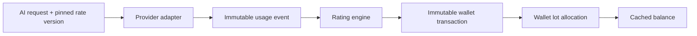

# Copilot Bridge Server V2 — billing contract

Contract version `2.0.0`; canonical App wire fields and errors are in [api-v2.md](api-v2.md). This document defines server-side accounting rules. Public production currently has `V2_BILLING_ENABLED=false`; no commercial point charging is live.

## Unit and authority

AI points are integer commercial units; one point is not one token. The server alone normalizes provider usage, rates it and updates a wallet. The App may display `WalletSummary` and settled `UsageRecord` but must never estimate a charge as authoritative. `usage_records` retains the V1 quota unit `usageCredit`, which is not AI points and is not converted into a historical point bill.

## Rate cards and policies

Each card is keyed by provider, model and trusted server-selected policy: `MANAGED_USAGE`, `BYOS_USAGE`, or `LOCAL_USAGE`. `MANAGED_USAGE` charges the managed provider's published rates; BYOS can use a separate service fee card; `LOCAL_USAGE` is zero points in the current engine. A client cannot choose its billing policy. Only one active version exists per card. A request pins `rate_card_version_id` before provider invocation; publication never changes a historical charge. A missing required active version rejects the request with `RATE_CARD_UNAVAILABLE`.

Rates are decimal points per 1,000 tokens for ordinary, cached and reasoning categories, plus decimal points per image/tool item; `minimumCharge` is an integer. Cached input and reasoning output are subsets of input/output totals and are removed from ordinary token counts before their special rates. The engine uses fixed-point integer arithmetic, rounds the combined amount up once, then applies `minimumCharge`. Normalized counters and the final charge are capped at PostgreSQL signed-int range; overflow is held for review, not silently wrapped.

## Settlement and insufficient funds

Every started billed request has at most one immutable final `usage_event`, keyed by its AI request ID. Provider-observed usage and cost are recorded separately from points. Missing provider cost stays `null`; it is never interpreted as free inference. A wallet debit locks the wallet row, checks nonnegative balance and appends an immutable transaction with a globally unique idempotency key. Concurrent requests cannot overdraw. If observed usage exceeds available points, the event records `pointsRated>0`, `pointsCharged=0`, `billingStatus='UNPAID'`; further billed requests return `INSUFFICIENT_POINTS`. Invalid provider counters produce `METERING_ERROR`, and rating failure produces `UNRATED`; both retain the event and block further billed requests with `BILLING_REVIEW_REQUIRED`. `NO_USAGE` has zero observed counters. A client disconnect with observed provider usage can still be rated and charged; native progressive upstream streaming and partial-usage recovery remain pending.

## Grants, lots and expiry

Subscription period grants are idempotent for `(subscription_id, period_start)` and create a positive ledger entry plus a point lot. `rolloverPolicy='NONE'` gives that lot an expiry at the period end; `UNLIMITED` grants and purchased or manually added points have no plan-period expiry. Debits allocate earliest-expiring points first, recording immutable lot-spend rows. Expiration debits only unspent points from expired lots, with one `EXPIRATION` ledger entry per lot. Wallet read lazily applies due expiry; an hourly job also sweeps due lots. Balance is a cache; ledger plus lot allocations are the audit evidence. Migration `0003` must be applied before this code runs. Production has no existing nonzero V2 wallets, so no historical lot backfill is needed for this deployment; any other environment with earlier V2 wallet credits must reconcile/backfill before migration cutover.

Referral registration does not award points. A configured qualifying paid order can create unique `REFERRAL_REWARD` ledger credits for eligible beneficiaries; risk flags require Admin review. Refunds and dispute settlement must be compensating ledger entries referencing the original event, never edits to an immutable event or transaction. Automated unpaid collection and monetary point valuation remain pending. `estimatedRevenue` and `grossMargin` remain `null` until payment accounting and a defensible point valuation exist.

## Reconciliation checks

For each wallet, `wallets.balance` must equal the sum of `wallet_transactions.points` and the sum of `wallet_lots.remaining_points`. A positive transaction must have one source lot; every negative transaction must have lot allocations summing to its absolute points. Each AI request has at most one final usage event and one usage-debit idempotency key. Investigate a mismatch and use a documented compensating transaction if needed; do not rewrite the ledger.
